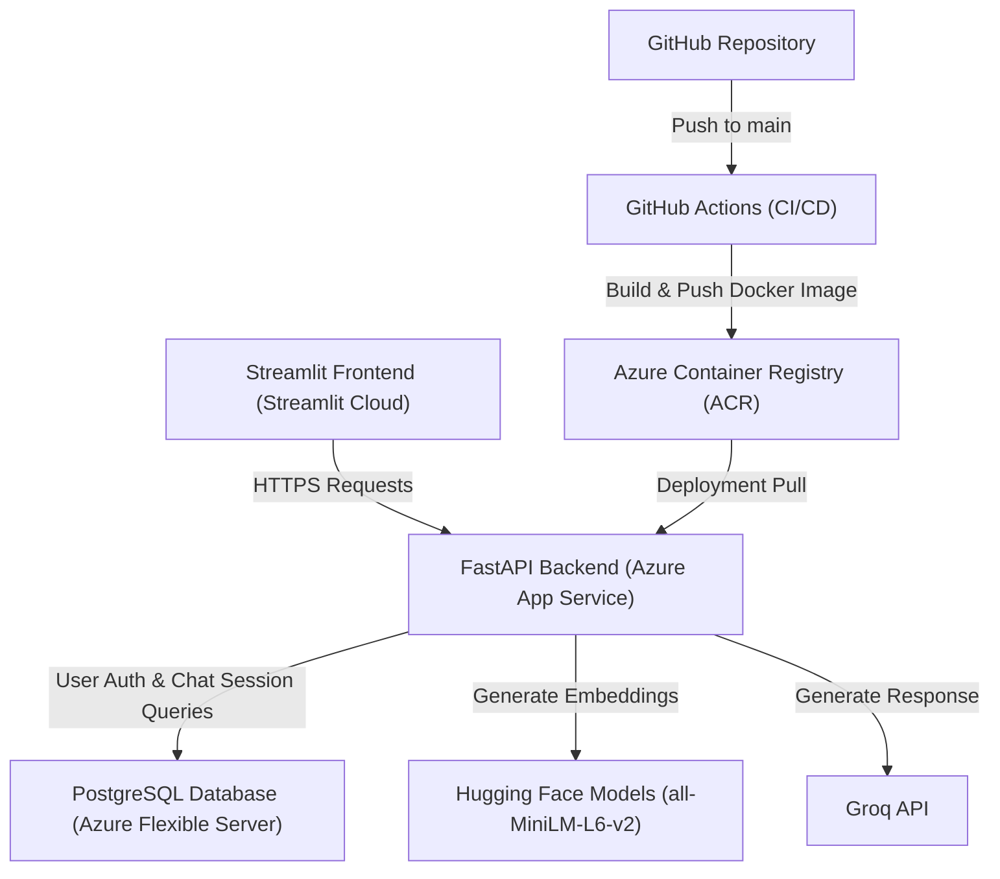

# 📄 Q&A RAG (Retrieval-Augmented Generation) Application

An enterprise-grade, cloud-deployed RAG application that allows users to register accounts, upload PDF documents, and ask questions using AI.

---

## 🚀 [Try Live Demo](https://ragsystem4.streamlit.app/)

---

## 🌐 Architecture Overview



* **Frontend**: Streamlit Community Cloud (Python)
* **Backend**: FastAPI packaged as a Docker container, hosted on **Azure App Service** (Linux Free Tier)
* **Database**: **Azure Database for PostgreSQL (Flexible Server)**
* **Vector Embeddings**: `all-MiniLM-L6-v2` (Hugging Face)
* **LLM Engine**: Groq API
* **CI/CD Pipeline**: GitHub Actions (automatically builds and pushes Docker images to Azure Container Registry on every push to `main`)

---

## 🚀 Getting Started

### Local Development

#### Option A: Running with Docker (Recommended)
1. Clone the repository:
   ```bash
   git clone https://github.com/3umrr/-Q-A-RAG.git
   cd -Q-A-RAG
   ```
2. Create a `.env` file in the root directory:
   ```env
   DATABASE_URL=postgresql://postgres:postgres@db:5432/rag_db
   GROQ_API_KEY=your_groq_api_key
   SECRET_KEY=your_jwt_secret_key
   ```
3. Start the application using Docker Compose:
   ```bash
   docker-compose up --build
   ```
4. Access the services:
   * **Frontend**: `http://localhost:8501`
   * **Backend API Docs**: `http://localhost:8000/docs`

#### Option B: Manual Setup
1. Create and activate a virtual environment:
   ```bash
   python -m venv venv
   source venv/bin/activate 
   ```
2. Install dependencies:
   ```bash
   pip install -r requirements.txt
   ```
3. Run the backend server:
   ```bash
   python -m uvicorn backend.main:app --reload --port 8000
   ```
4. In a separate terminal, run the Streamlit frontend:
   ```bash
   streamlit run frontend/app.py
   ```

---

## 🔄 How CI/CD and Code Updates Work

When you make changes to the code (e.g., adding features, updating backend models, fixing bugs) and push them to GitHub:

1. **GitHub Actions** automatically runs the `.github/workflows/deploy.yml` pipeline.
2. It builds the new Docker image and pushes it to your registry at `qaragacr.azurecr.io/qarag-fastapi:latest`.
3. To deploy the new image to your Azure Web App:
   * **Automatic Option**: If Continuous Deployment is turned on in your Azure Portal (under **App Service → Deployment Center**), Azure will automatically detect the new image and pull it.
   * **Manual Option**: If Continuous Deployment is off, simply go to your Web App in the Azure Portal and click **"Restart"**. Azure will pull the latest version of your image from the container registry on startup.
